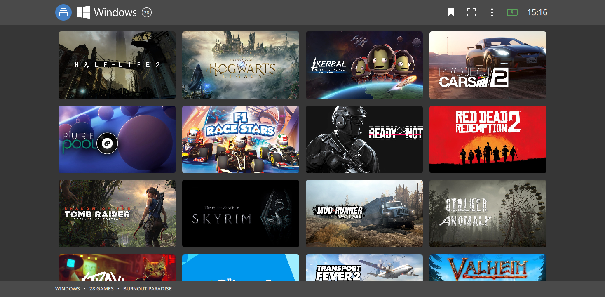
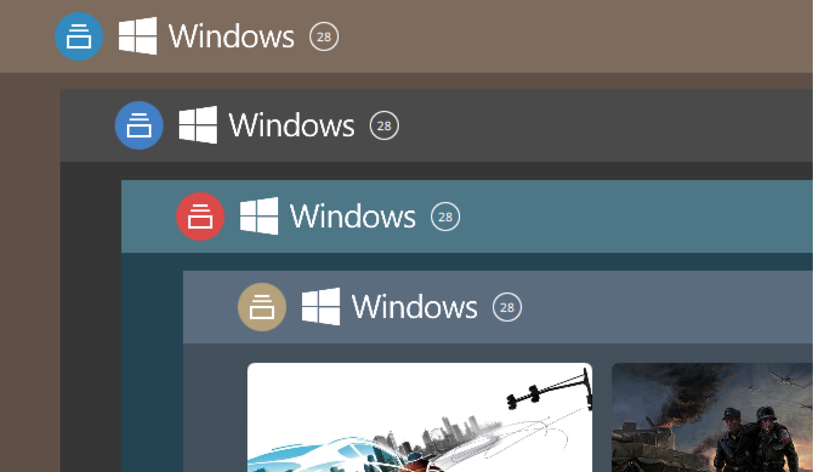
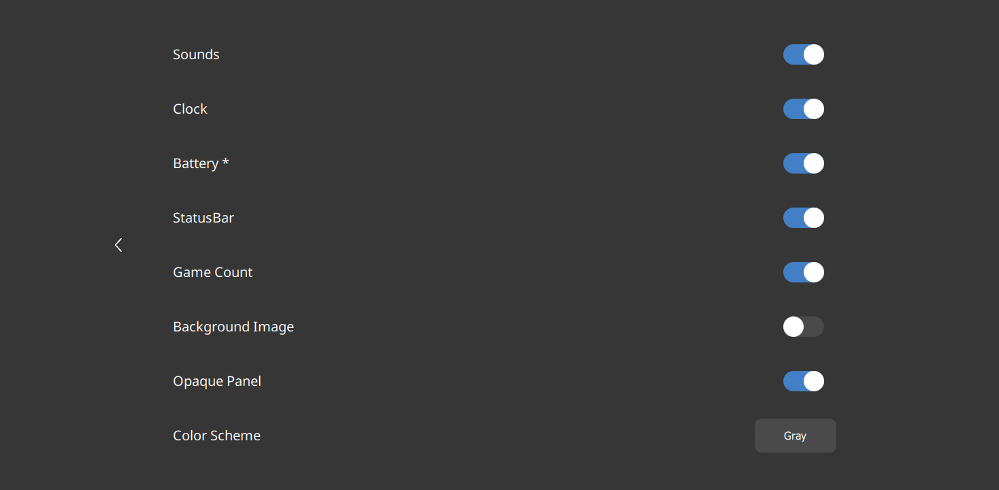

# EasyLaunch
  

# Theme "EasyLaunch" for [Pegasus Frontend](http://pegasus-frontend.org/)

<b>A simple theme for quick launch games from your collection.</b>

- Fast and simple navigation for selecting collections and games
- Support for keyboard, mouse and gamepad navigation
- Convenient fullscreen button (overrides the default setting)
- Ability to set a home collection that activates on startup
- Clock and battery indicators (if supported by the device)
- Proper display on ultrawide monitors
- Adaptive game grid that adjusts to window size
- Interface customization settings
- Multiple color scheme options

     

# Replace background
Replace "background.jpg" in "Pegasus Frontend\themes\EasyLaunch\assets\img" and enable background display in the theme settings.

# Installation
Download the theme and place it in your [Pegasus theme directory](http://pegasus-frontend.org/docs/user-guide/installing-themes/).

# Download
Download EasyLaunch theme [last releases](https://github.com/VGmove/EasyLaunch/archive/refs/heads/main.zip).
