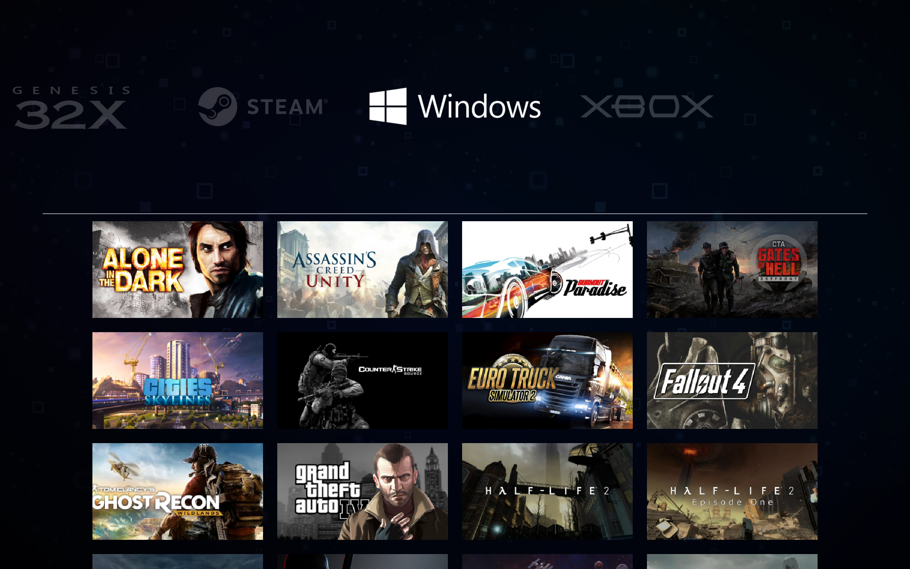

# EasyLaunch
  
  

# EasyLaunch theme for [Pegasus Frontend](http://pegasus-frontend.org/)
A simple theme for quick launch games from your collection.

- Supports navigation using gamepad and keyboard/mouse.
- Clock and battery(if available in device) icons.
- Displaying the number of games in the collection.

# Installation
Download the theme and place it in your [Pegasus theme directory](http://pegasus-frontend.org/docs/user-guide/installing-themes/).

# Download
Download EasyLaunch theme [last releases](https://github.com/VGmove/EasyLaunch/archive/refs/heads/main.zip).
